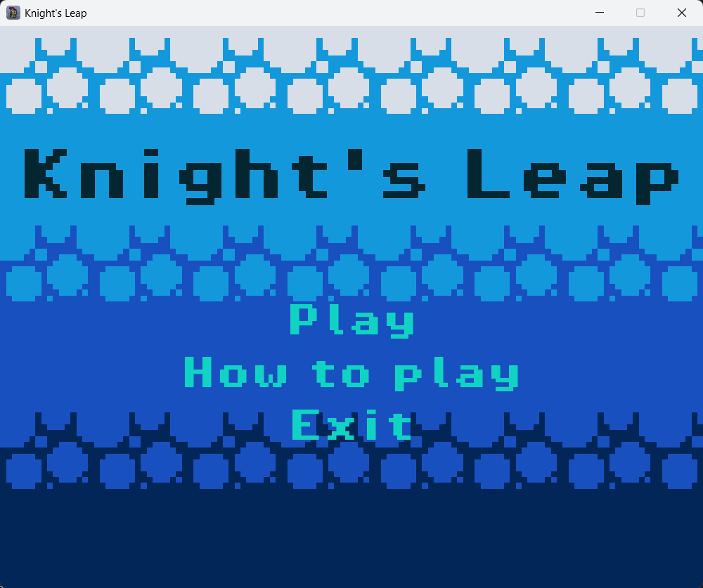
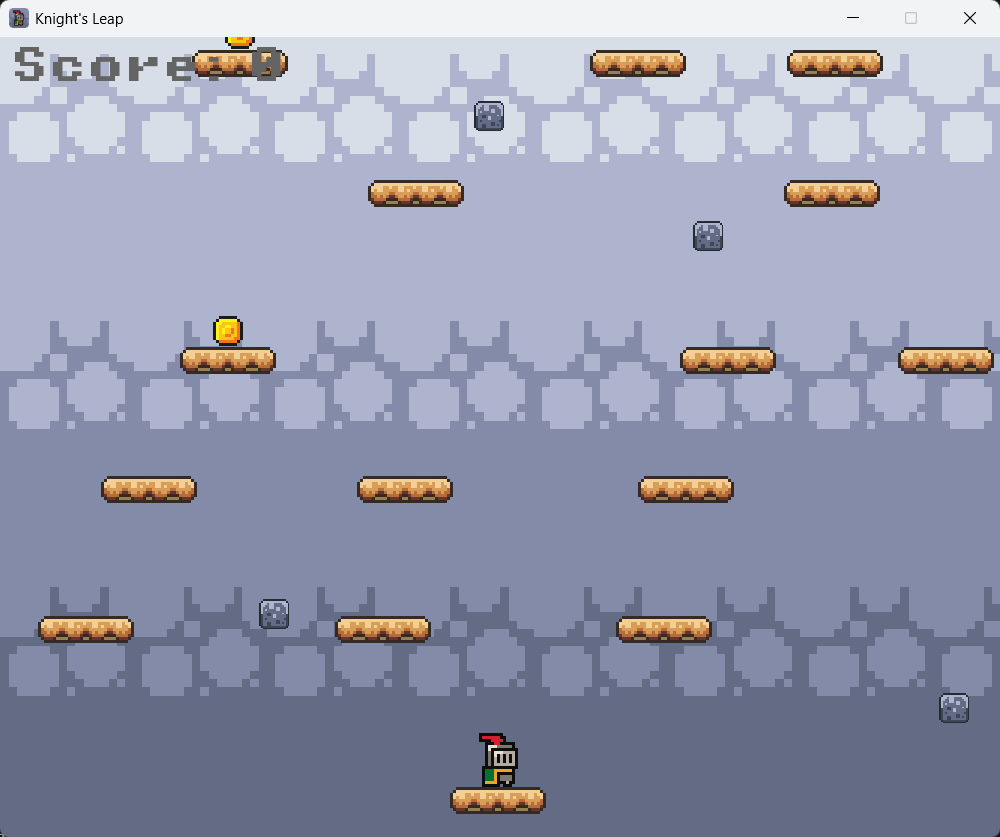
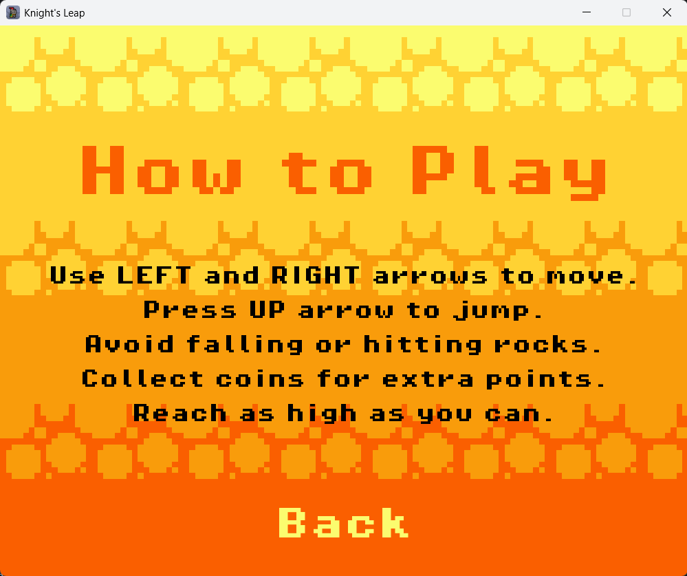
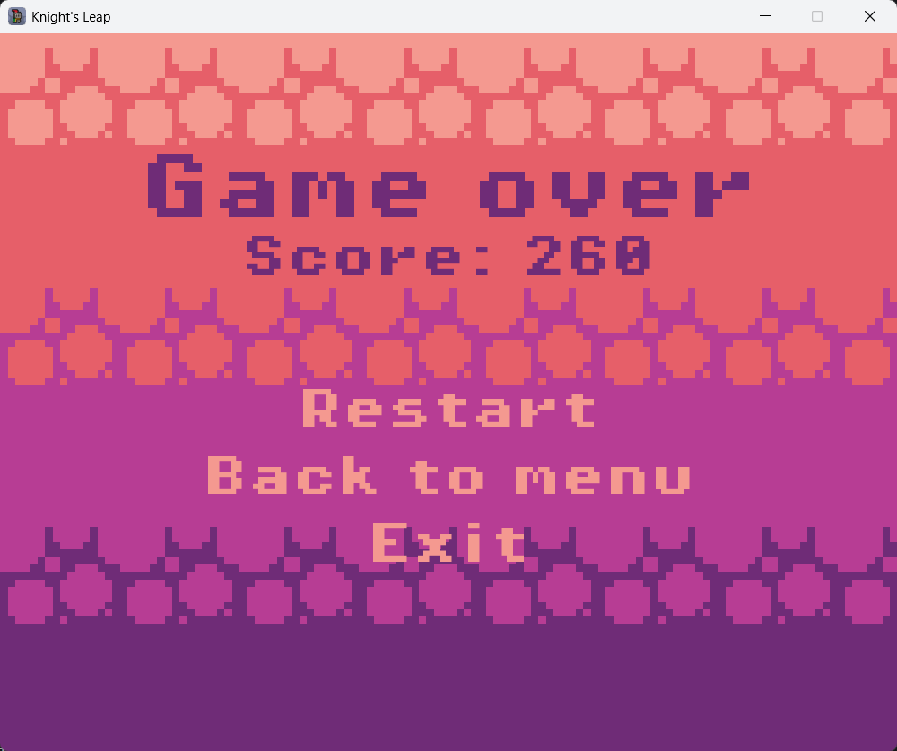
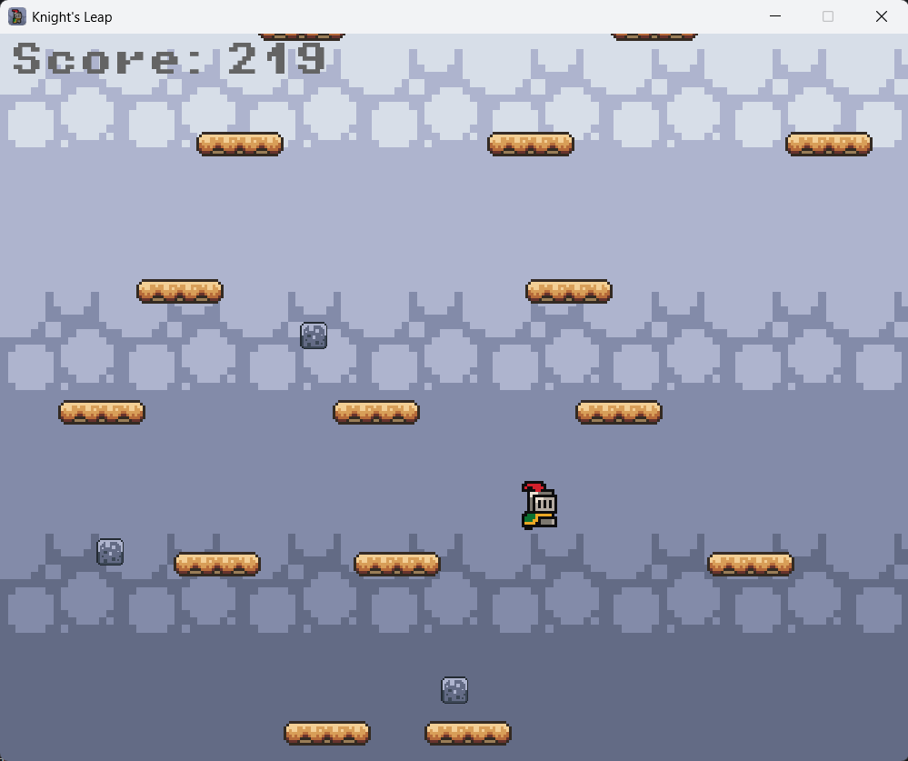

# Knight's Leap

## Description

*Knight's Leap* is a 2D game developed with **Pygame**, featuring a medieval knight jumping between platforms, dodging falling rocks, and earning points. The goal is to survive as long as possible while increasing your score

## Screenshots











## Demostration Video

[](https://www.youtube.com/watch?v=HYda4bdkV6E)

## Game Rules

- Use the **LEFT** and **RIGHT** arrow keys (or **A** and **D**) to move the knight.
- Press the **UP** arrow key (or **W**) to jump.
- Avoid falling off the platforms or getting hit by falling rocks.
- Collect coins to earn extra points.
- The goal is to climb as high as possible by jumping between platforms.

## Design Patterns Applied

### Singleton Pattern

- The **ResourceManager** class implements the Singleton pattern to ensure that only one instance manages all game resources such as images, sounds, and fonts.
- This guarantees efficient resource loading and prevents redundant memory usage by sharing loaded assets across the game.

### Factory Method Pattern

- The **EntityFactory** class uses the Factory Method pattern to create game entities like players, platforms, rocks, and coins.
- This encapsulates the creation logic, allowing for easy adjustments to entity instantiation without modifying the main game code.

### State Pattern

- The game uses the **State pattern** to manage different screens: Menu, How To Play, Playing, and Game Over.
- Each state is represented by a class that handles its own events, updates, and drawing.
- This design keeps the game loop clean and modular, facilitating maintenance and future extensions.

## Group Members

- Enzo Rojas
- Matías Agüero
- Gustavo Vera
- Lautaro Videla

## Installation and Execution

### 1. Clone the repository:

```sh
git clone https://github.com/user/knights-leap.git
cd knights-leap
```

### 2. Create virtual environment:

- Windows:

```sh
python -m venv <environment_name>
```

- Linux/macOS:

```sh
python3 -m venv <environment_name>
```

### 3. Activate virtual environment:

- Windows:

```sh
<environment_name>\scripts\activate
```

- Linux / macOS:

```sh
source <environment_name>/bin/activate
```

### 4. Install dependencies:

```sh
pip install -r requirements.txt
```

### 5. Run the game:

```sh
python main.py`
```